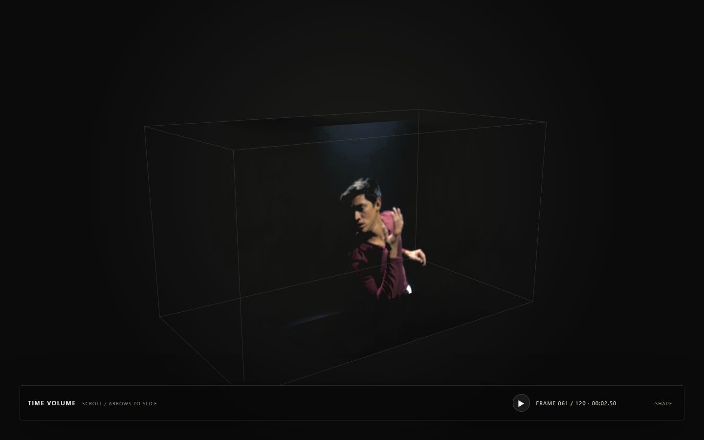
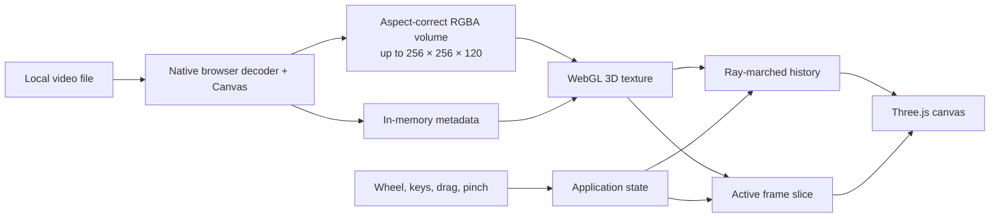

# Time Volume

A local video transformed into a block of time you can move through.

Choose a video and its first five seconds are processed entirely in your browser. Every sampled frame is stacked along the depth axis; scroll or use the arrow keys to move the highlighted slice through the recording while the surrounding frames remain visible as a translucent volume.



## How it works

1. **Choose.** A local video stays on the device; the app never uploads it to a server.
2. **Sample.** The browser takes 120 chronological frames from up to the first five seconds and fits the video's longest edge to 256 pixels without changing its shape.
3. **Pack.** Each frame gets transparency from luminance and is packed into one GPU-ready RGBA volume. Bright, full-frame footage is rendered more lightly to keep the stacked frames legible.
4. **Upload.** The browser loads that volume into a WebGL 3D texture.
5. **Volume.** A GLSL ray marcher accumulates nearby frames into the dark, translucent body of the recording.
6. **Slice.** A separate plane samples the selected frame at full clarity so the subject remains legible inside the history.
7. **Explore.** The wheel and arrow keys move through time. Dragging orbits the camera and pinching zooms.

## System design



The selected file and transformed pixels remain in memory inside the browser. Nothing is sent to a backend or remote video host.

## Controls

| Input               | Action              |
| ------------------- | ------------------- |
| Wheel or arrow keys | Move through frames |
| Space               | Play or pause       |
| Drag                | Orbit the volume    |
| Pinch               | Zoom                |
| Double-click        | Refocus the camera  |
| `R`                 | Reset the view      |

## Run it

```bash
npm install
npm run dev
```

Open the local URL printed by Vite and choose a video. Current desktop browsers work best with MP4 or WebM files they can decode natively.

```bash
npm test -- --run
npm run test:e2e
npm run build
```

The repository also retains the original reproducible dancer-volume pipeline:

```bash
npm run volume:build -- --input assets/source/dancer.mp4 --start 00:00:04.000 --duration 5
```

## Repository map

| Path                      | What's in it                                                                    |
| ------------------------- | ------------------------------------------------------------------------------- |
| `src/`                    | video processing, state, controls, camera, chooser, WebGL renderer, and shaders |
| `scripts/build-volume.ts` | deterministic offline video-to-volume pipeline                                  |
| `public/volume/`          | the original production RGBA volume and metadata                                |
| `assets/source/`          | source provenance and rebuild notes; the MP4 itself is ignored                  |
| `tests/`                  | sampling, state, controls, rendering, and browser interaction tests             |
| `media/`                  | repository imagery                                                              |

## Credits

The original example footage is [Dancing in the dark](https://mixkit.co/free-stock-video/dancing-in-the-dark-1026/) from Mixkit, used under the [Mixkit Stock Video Free License](https://mixkit.co/license/#videoFree). Rendering uses [Three.js](https://threejs.org/). The optional offline pipeline uses [FFmpeg](https://ffmpeg.org/) and [Sharp](https://sharp.pixelplumbing.com/).
