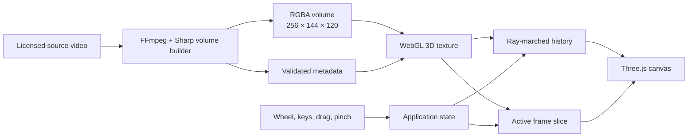

# Time Volume

A dancer recorded as a block of time you can move through.

Every video frame is stacked along the depth axis. Scroll or use the arrow keys to move the highlighted slice through the performance while the surrounding frames remain visible as a translucent volume.


## How it works

1. **Source.** A fixed five-second excerpt is sampled at 24 frames per second, giving the volume 120 chronological layers.
2. **Pack.** The build script scales each frame to 256×144, derives transparency from luminance, flips its rows for WebGL coordinates, and writes one deterministic RGBA binary.
3. **Upload.** The browser validates the metadata and byte count before loading the frames into a WebGL 3D texture.
4. **Volume.** A GLSL ray marcher accumulates the nearby frames into the dark, translucent body of the performance.
5. **Slice.** A separate plane samples the selected frame at full clarity so the dancer remains legible inside the history.
6. **Explore.** The wheel and arrow keys move through time. Dragging orbits the camera, pinching zooms, and the shape controls change density, slice thickness, and time depth.

## System design



The source MP4 stays out of Git. The transformed volume is committed so the experience is fixed, reproducible, and does not depend on a remote video host at runtime.

## Controls

| Input                | Action                                     |
| -------------------- | ------------------------------------------ |
| Wheel or arrow keys  | Move through frames                        |
| Space or play button | Play or pause                              |
| Drag                 | Orbit the volume                           |
| Pinch                | Zoom                                       |
| Double-click         | Refocus the camera                         |
| `H`                  | Hide or show the interface                 |
| `R`                  | Reset the view                             |
| Shape controls       | Adjust density, slice thickness, and depth |

## Run it

```bash
npm install
npm run dev
```

Open the local URL printed by Vite. The committed dancer volume is ready to use.

```bash
npm test -- --run
npm run test:e2e
npm run build
```

To rebuild the volume from a locally retained source file:

```bash
npm run volume:build -- --input assets/source/dancer.mp4 --start 00:00:04.000 --duration 5
```

## Repository map

| Path                      | What's in it                                                                          |
| ------------------------- | ------------------------------------------------------------------------------------- |
| `src/`                    | application state, controls, camera, UI, WebGL renderer, and shaders                  |
| `scripts/build-volume.ts` | deterministic video-to-volume pipeline                                                |
| `public/volume/`          | the production RGBA volume and its metadata                                           |
| `assets/source/`          | source provenance and rebuild notes; the MP4 itself is ignored                        |
| `tests/`                  | state, controls, asset validation, pipeline, rendering, and browser interaction tests |
| `media/`                  | repository imagery                                                                    |

## Credits

The performance footage is [Dancing in the dark](https://mixkit.co/free-stock-video/dancing-in-the-dark-1026/) from Mixkit, used under the [Mixkit Stock Video Free License](https://mixkit.co/license/#videoFree). Rendering uses [Three.js](https://threejs.org/); video preparation uses [FFmpeg](https://ffmpeg.org/) and [Sharp](https://sharp.pixelplumbing.com/).
